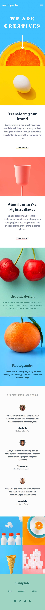
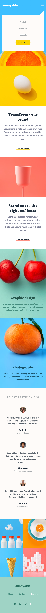
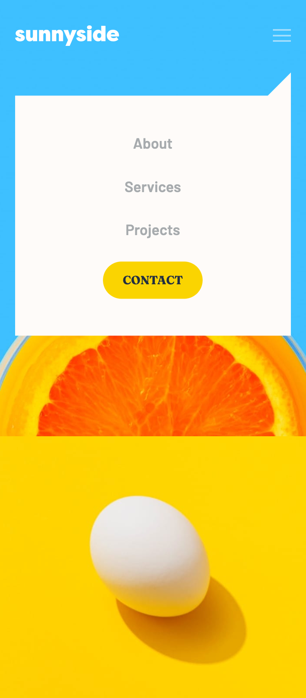

# Frontend Mentor - Sunnyside agency landing page solution

This is a solution to the [Sunnyside agency landing page challenge on Frontend Mentor](https://www.frontendmentor.io/challenges/sunnyside-agency-landing-page-7yVs3B6ef). Frontend Mentor challenges help you improve your coding skills by building realistic projects.

## Table of contents

- [Overview](#overview)
  - [The challenge](#the-challenge)
  - [Screenshot](#screenshot)
  - [Links](#links)
- [My process](#my-process)
  - [Built with](#built-with)
  - [What I learned](#what-i-learned)
  - [Continued development](#continued-development)
- [Author](#author)

**Note: Delete this note and update the table of contents based on what sections you keep.**

## Overview

- This challenge will be a perfect test of your layout and responsive skills. There's a tiny bit of JS for the mobile menu, but the focus is HTML & CSS.

### The challenge

Users should be able to:

- View the optimal layout for the site depending on their device's screen size
- See hover states for all interactive elements on the page

### Screenshot

### Links

- Solution URL: [Add solution URL here](https://your-solution-url.com)
- Live Site URL: [Add live site URL here](https://your-live-site-url.com)

## My process

### Built with

- Semantic HTML5 markup
- CSS custom properties
- Flexbox
- CSS Grid
- Vanilla JS

### What I learned

This is my first landing project made which means I've spent a lot of time researching things and learning how to apply what I learnt.

Probably the biggest challenge was to make page responsive. I ran into some issues when I used multiple media queries and then when I created a new one the previous query didn't work as expected. I think I need to spend more time learning how to organize my CSS.

Another thing I learnt was incorporating combinations of Flex and Grid, I understood more the way you can use the two and how to choose which one is best for what I was trying to achieve.

Overall I think it ended up being pretty good, not sure why my heading title font does not look the same as on the design...

To see how you can add code snippets, see below:

Lastly, the thing I'm probably most proud of is using custom properties. THANK YOU KEVIN POWELL for teaching me those. I was able to better imagine what I wanted to do next because by the time I finished writing my HTML, the bg-images, font-sizes, weights etc. were already there! Game changer.

### Continued development

Carry on building landing pages, I would like to try and learn more animated way to display mobile-nav. I will definitely work on my media queries as well as become better at using custom properties.

## Author

- Frontend Mentor - [@achrustowski](https://www.frontendmentor.io/profile/achrustowski)
